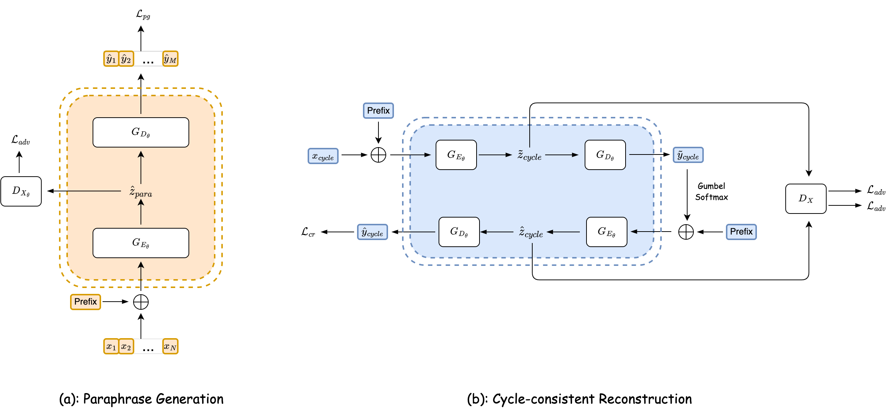

# Style Transfer as Data Augmentation: A Case Study on Named Entity Recognition
<p align="right"><i>Authors: Shuguang Chen, Leonardo Neves and Thamar Solorio</i></p> 

[](https://opensource.org/licenses/MIT) 

This repository contains the implementations of the system described in the paper ["Style Transfer as Data Augmentation: A Case Study on Named Entity Recognition"](https://aclanthology.org/2022.emnlp-main.120/) at [EMNLP 2022](https://2022.emnlp.org) conference.

<div></div>

The main contribution of this paper is a novel neural architecture that can effectively transform the text from a high-resource domain to a low-resource domain by changing its style-related attributes to generate synthetic data for training. Please refer to the [paper](https://aclanthology.org/2022.emnlp-main.120/) for details.


## Installation
We have updated the code to work with Python 3.10, Pytorch 1.12, and CUDA 11.3. If you use conda, you can set up the environment as follows:
```bash
conda create -n DA_NER python==3.10
conda activate DA_NER
conda install pytorch==1.12 cudatoolkit=11.3 -c pytorch
```

Also, install the dependencies specified in the requirements.txt:
```
pip install -r requirements.txt
```


## Data
Please download the data with the following links: [GYAFC Corpus](https://github.com/raosudha89/GYAFC-corpus), [OntoNotes-5.0-NER-BIO](https://github.com/faker2cumtb/OntoNotes-5.0-NER-BIO), and [Temporal Twitter Corpus](https://github.com/shrutirij/temporal-twitter-corpus). We provide toy datasets under the `data/linearized_domain` directory in the json format for style transfer and `data/ner` directory in the CoNLL format for NER. After downloading the data with the links above, you may need to process it so that it can have the same format as toy datasets and put them under the corresponding directory. Please refer to the [paper](https://aclanthology.org/2022.emnlp-main.120/) for more details.

#### <ins>Data processing</ins>
For data processing, we provide some functions in `src/commons/preproc_domain.py` to convert the data between the json and CoNLL format.


## Running
This project consists of two parts:
1. Style transfer with pre-trained langauge models
2. Named entity recognition with sequencel labeling models

It is highly recommended to use the [huggingface/accelerate](https://github.com/huggingface/accelerate) library to accelerate training for style transfer. It supports many optimization techniques such as distributed training and mixed precision. You can simply replace `python` with `accelerate launch` to run the following commands. Note that the code in this repo for named entity recognition doesn't support it.


### 1. Style Transfer

#### <ins>Training</ins>
For style transfer, the training process begins with the paraphrase generation as the first stage: the generator is trained with the paraphrase generation objective while the discriminator is trained with the adversarial learning objective. In the second stage, both paraphrase generation and cycle-consistent reconstruction are involved: the cycle-consistent reconstruction objective is further incorporated to train the generator.

##### First-stage training:
You can run the following command to pre-train a lanaguge model for style transfer:
```
CUDA_VISIBLE_DEVICES=[gpu_id] python src/exp_lm/main.py --config configs/exp_lm/pretraining/lm0.0-t5-base.json --mode pretrain
```

##### Second-stage training:
The second-stage training requires a pre-trained model checkpoint from the first-stage training. After the first-stage training is done, you can run the following command to fine-tune a pre-trained model to transfer data between domains:
```
CUDA_VISIBLE_DEVICES=[gpu_id] python src/exp_lm/main.py --config configs/exp_lm/finetuning/lm1.1-nw-sm.json --mode train
```

The code saves a model checkpoint after every epoch if the model improves (either lower loss or higher metric). You will notice that a directory is created using the experiment id (e.g. DA_NER/results/lm/lm1.1-nw-sm/checkpoint/). You can update the config file to resume training by running the same command.

#### <ins>Evaluation</ins>
To evaluate the model, use --mode eval (default: train):
```
CUDA_VISIBLE_DEVICES=[gpu_id] python src/exp_lm/main.py --config configs/exp_lm/finetuning/lm1.1-nw-sm.json --mode eval
```

#### <ins>Generation</ins>
To generate synthetic data, use --mode generate (default: train):
```
CUDA_VISIBLE_DEVICES=[gpu_id] python src/exp_lm/main.py --config configs/exp_lm/finetuning/lm1.1-nw-sm.json --mode generate
```

### 2. Named Entity Recognition (NER)
We fine-tune a sequence labeling model (BERT + Linear) to evaluate the proposed style transfer method. After generating the data, you can convert it from the json format tot the CoNLL format and add the path of the generated data into the config file to run NER experiments with the following command:
```
CUDA_VISIBLE_DEVICES=[gpu_id] python src/exp_ner/main.py --config configs/exp_ner/ner1.1-nw-sm.json
```


## Citation
```
@inproceedings{chen-etal-2022-style,
    title = "Style Transfer as Data Augmentation: A Case Study on Named Entity Recognition",
    author = "Chen, Shuguang  and
      Neves, Leonardo  and
      Solorio, Thamar",
    booktitle = "Proceedings of the 2022 Conference on Empirical Methods in Natural Language Processing",
    month = dec,
    year = "2022",
    address = "Abu Dhabi, United Arab Emirates",
    publisher = "Association for Computational Linguistics",
    url = "https://aclanthology.org/2022.emnlp-main.120",
    pages = "1827--1841",
    abstract = "In this work, we take the named entity recognition task in the English language as a case study and explore style transfer as a data augmentation method to increase the size and diversity of training data in low-resource scenarios. We propose a new method to effectively transform the text from a high-resource domain to a low-resource domain by changing its style-related attributes to generate synthetic data for training. Moreover, we design a constrained decoding algorithm along with a set of key ingredients for data selection to guarantee the generation of valid and coherent data. Experiments and analysis on five different domain pairs under different data regimes demonstrate that our approach can significantly improve results compared to current state-of-the-art data augmentation methods. Our approach is a practical solution to data scarcity, and we expect it to be applicable to other NLP tasks.",
}
```


## Contact
Feel free to get in touch via email to schen52@uh.edu.
